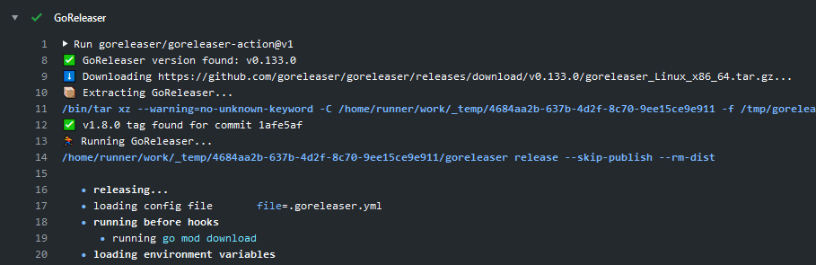

<p align="center">
  
  <h3 align="center">GoReleaser Action</h3>
  <p align="center"><a href="https://github.com/features/actions">GitHub Action</a> for GoReleaser</p>
  <p align="center">
    <a href="https://github.com/goreleaser/goreleaser-action/releases/latest"></a>
    <a href="https://github.com/marketplace/actions/goreleaser-action"></a>
    <a href="https://github.com/goreleaser/goreleaser-action/actions?workflow=test"></a>
    <a href="https://codecov.io/gh/goreleaser/goreleaser-action"></a>
  </p>
</p>

___



* [Usage](#usage)
  * [Workflow](#workflow)
  * [Run on new tag](#run-on-new-tag)
  * [Signing](#signing)
  * [Upload artifacts](#upload-artifacts)
  * [Install Only](#install-only)
* [Customizing](#customizing)
  * [inputs](#inputs)
  * [outputs](#outputs)
  * [environment variables](#environment-variables)
* [Limitation](#limitation)
* [Development](#development)
* [License](#license)

## Usage

GoReleaser Action runs [goreleaser][], please follow its [docs][gdocs] for
more information about how to customize what GoReleaser do.

[goreleaser]: https://goreleaser.com/
[gdocs]: https://goreleaser.com/customization

### Workflow

```yaml
name: goreleaser

on:
  pull_request:
  push:

permissions:
  contents: write

jobs:
  goreleaser:
    runs-on: ubuntu-latest
    steps:
      -
        name: Checkout
        uses: actions/checkout@v4
        with:
          fetch-depth: 0
      -
        name: Set up Go
        uses: actions/setup-go@v4
      -
        name: Run GoReleaser
        uses: goreleaser/goreleaser-action@v5
        with:
          # either 'goreleaser' (default) or 'goreleaser-pro'
          distribution: goreleaser
          # 'latest', 'nightly', or a semver
          version: '~> v2'
          args: release --clean
        env:
          GITHUB_TOKEN: ${{ secrets.GITHUB_TOKEN }}
          # Your GoReleaser Pro key, if you are using the 'goreleaser-pro' distribution
          # GORELEASER_KEY: ${{ secrets.GORELEASER_KEY }}
```

> **IMPORTANT**: note the `fetch-depth: 0` input in `Checkout` step. It is required  for the changelog to work correctly.

### Run on new tag

If you want to run GoReleaser only on new tag, you can use this event:

```yaml
on:
  push:
    tags:
      - '*'
```

Or with a condition on GoReleaser step:

```yaml
      -
        name: Run GoReleaser
        uses: goreleaser/goreleaser-action@v5
        if: startsWith(github.ref, 'refs/tags/')
        with:
          version: '~> v2'
          args: release --clean
        env:
          GITHUB_TOKEN: ${{ secrets.GITHUB_TOKEN }}
```

> For detailed instructions please follow GitHub Actions [workflow syntax](https://help.github.com/en/articles/workflow-syntax-for-github-actions#About-yaml-syntax-for-workflows).

### Signing

If [signing is enabled](https://goreleaser.com/customization/#Signing) in your GoReleaser configuration, you can use
the [Import GPG](https://github.com/crazy-max/ghaction-import-gpg) GitHub Action along with this one:

```yaml
      -
        name: Import GPG key
        id: import_gpg
        uses: crazy-max/ghaction-import-gpg@v6
        with:
          gpg_private_key: ${{ secrets.GPG_PRIVATE_KEY }}
          passphrase: ${{ secrets.PASSPHRASE }}
      -
        name: Run GoReleaser
        uses: goreleaser/goreleaser-action@v5
        with:
          version: '~> v2'
          args: release --clean
        env:
          GITHUB_TOKEN: ${{ secrets.GITHUB_TOKEN }}
          GPG_FINGERPRINT: ${{ steps.import_gpg.outputs.fingerprint }}
```

And reference the fingerprint in your signing configuration using the `GPG_FINGERPRINT` environment variable:

```yaml
signs:
  - artifacts: checksum
    args: ["--batch", "-u", "{{ .Env.GPG_FINGERPRINT }}", "--output", "${signature}", "--detach-sign", "${artifact}"]
```

### Upload artifacts

For some events like pull request or schedule you might want to store the artifacts somewhere for testing
purpose. You can do that with the [actions/upload-artifact](https://github.com/actions/upload-artifact) action:

```yaml
      -
        name: Run GoReleaser
        uses: goreleaser/goreleaser-action@v5
        with:
          version: '~> v2'
          args: release --clean
          workdir: myfolder
        env:
          GITHUB_TOKEN: ${{ secrets.GITHUB_TOKEN }}
      -
        name: Upload assets
        uses: actions/upload-artifact@v3
        with:
          name: myapp
          path: myfolder/dist/*
```

### Install Only

```yaml
steps:
  -
    name: Install GoReleaser
    uses: goreleaser/goreleaser-action@v5
    with:
      install-only: true
  -
    name: Show GoReleaser version
    run: goreleaser -v
```

## Customizing

### inputs

Following inputs can be used as `step.with` keys

| Name             | Type    | Default      | Description                                                      |
|------------------|---------|--------------|------------------------------------------------------------------|
| `distribution`   | String  | `goreleaser` | GoReleaser distribution, either `goreleaser` or `goreleaser-pro` |
| `version`**¹**   | String  | `~> v2`      | GoReleaser version                                               |
| `args`           | String  |              | Arguments to pass to GoReleaser                                  |
| `workdir`        | String  | `.`          | Working directory (below repository root)                        |
| `install-only`   | Bool    | `false`      | Just install GoReleaser                                          |

> **¹** Can be a fixed version like `v0.117.0` or a max satisfying semver one like `~> 0.132`. In this case this will return `v0.132.1`.

### outputs

Following outputs are available

| Name        | Type | Description            |
|-------------|------|------------------------|
| `artifacts` | JSON | Build result artifacts |
| `metadata`  | JSON | Build result metadata  |

### environment variables

Following environment variables can be used as `step.env` keys

| Name             | Description                                                                                                                                         |
|------------------|-----------------------------------------------------------------------------------------------------------------------------------------------------|
| `GITHUB_TOKEN`   | [GITHUB_TOKEN](https://help.github.com/en/actions/configuring-and-managing-workflows/authenticating-with-the-github_token) as provided by `secrets` and requires `contents:write` |
| `GORELEASER_KEY` | Your [GoReleaser Pro](https://goreleaser.com/pro) License Key, in case you are using the `goreleaser-pro` distribution                              |

## Limitation

`GITHUB_TOKEN` permissions [are limited to the repository](https://help.github.com/en/actions/configuring-and-managing-workflows/authenticating-with-the-github_token#about-the-github_token-secret)
that contains your workflow.

If you need to push the homebrew tap to another repository, you must therefore create a custom [Personal Access Token](https://help.github.com/articles/creating-a-personal-access-token-for-the-command-line/)
with `repo` permissions and [add it as a secret in the repository](https://help.github.com/en/actions/automating-your-workflow-with-github-actions/creating-and-using-encrypted-secrets). If you create a
secret named `GH_PAT`, the step will look like this:

```yaml
      -
        name: Run GoReleaser
        uses: goreleaser/goreleaser-action@v5
        with:
          version: '~> v2'
          args: release --clean
        env:
          GITHUB_TOKEN: ${{ secrets.GH_PAT }}
```

## Migrating from v3

If you need the auto-snapshot feature, take a look at [this example repository](https://github.com/caarlos0/goreleaser-action-v4-auto-snapshot-example): it's a minimal working example with all you need.

## Development

```
# format code and build javascript artifacts
docker buildx bake pre-checkin

# validate all code has correctly formatted and built
docker buildx bake validate

# run tests
docker buildx bake test
```

## License

MIT. See `LICENSE` for more details.
